<h1 style="color: peru">
MicroServices Demo
</h1>
<h5 style="color: #cdbc3f">Steps to create this microservice architecture:</h5>
<ul>
<li>Create Register Service in our demo Eureka discovery</li>
<li>Create Gateway Service to dispatch the incoming requests</li>
<li>Create Customer Service to manage customers</li>
<li>Create Inventory Service to manage products</li>
<li>Create Billing Service to manage bills
<ul>
<li>Create Open Feign Interface to interact with other microservices</li>
</ul>
</li>
</ul>

1. **Create Discovery Service**

In application.properties file we added some configuration to set up our eureka  register.

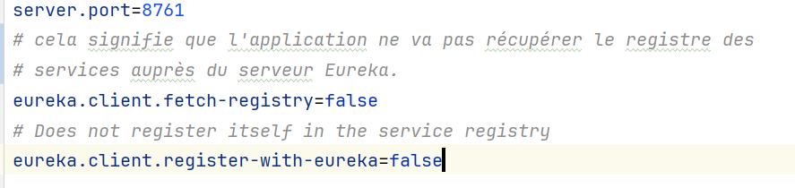

and then when we run our microservice and access to it by the port 8761 we display eureka discovery interface like below.

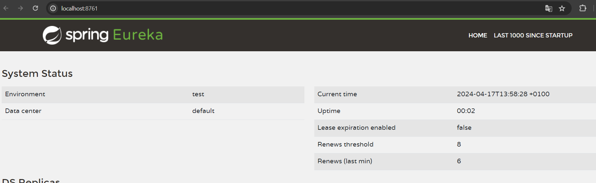

2. **Create Gateway Service**

First Thing we added a config file (application.yml) which we added some config.

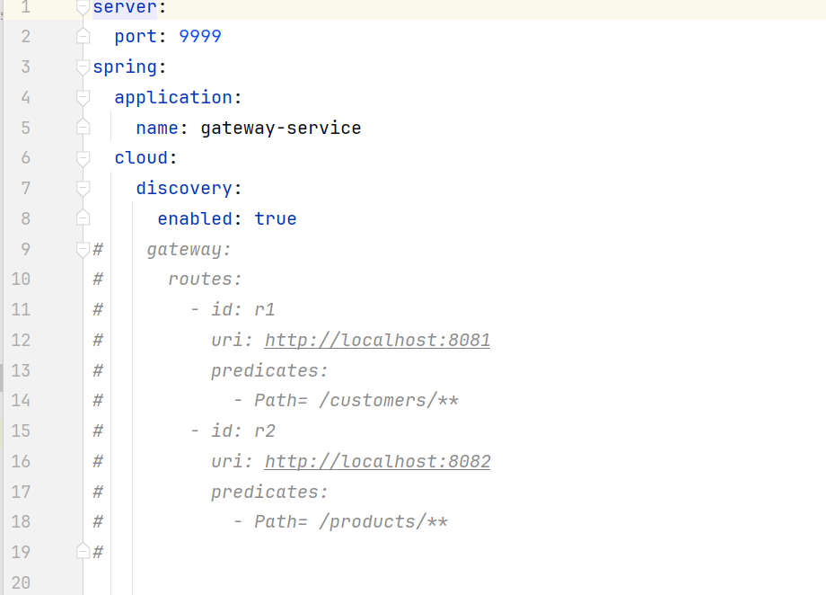

Like you see we added the port of this microservice,and also the application name,and for the latest property is related to register this microservice to eureka discovery register. 

For commented area relates to static routing but we removed it because we switched to dynamic routing. 

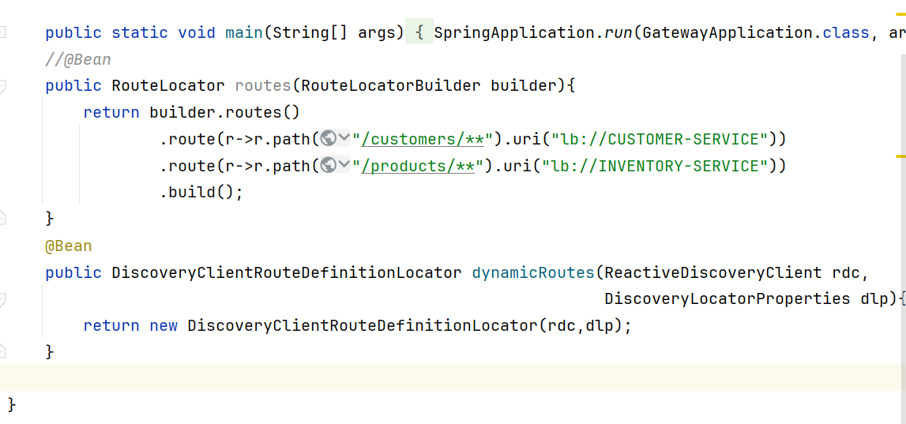
This how we apply dynamic routing programmatically.

3. **Create Customer Service**
<ul>Steps to create this micros.
<li>1. create Customer Entity.
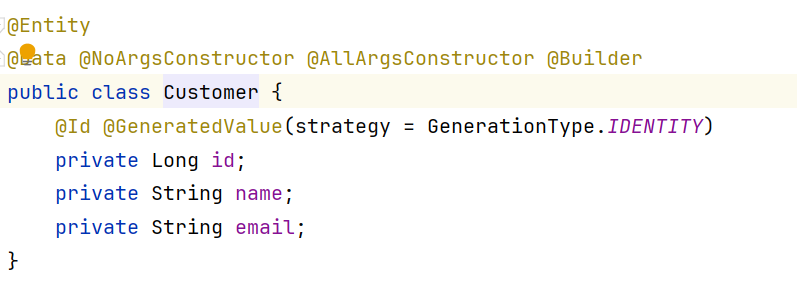
</li>
<li>2. create Customer Repository.
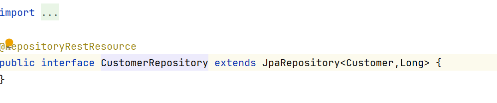</li>
<li>3. Added application.properties file to register this micros to eureka discovery and also the database infos.
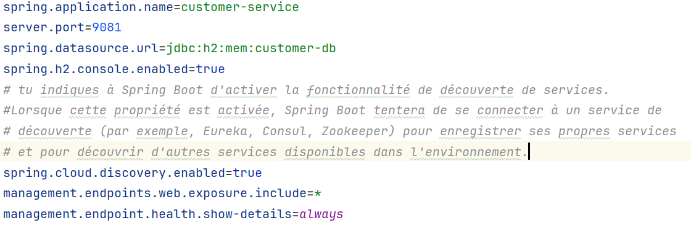</li>
<li>4. Display result which we contact the gateway and then the gateway dispatch this request to the correct micros.
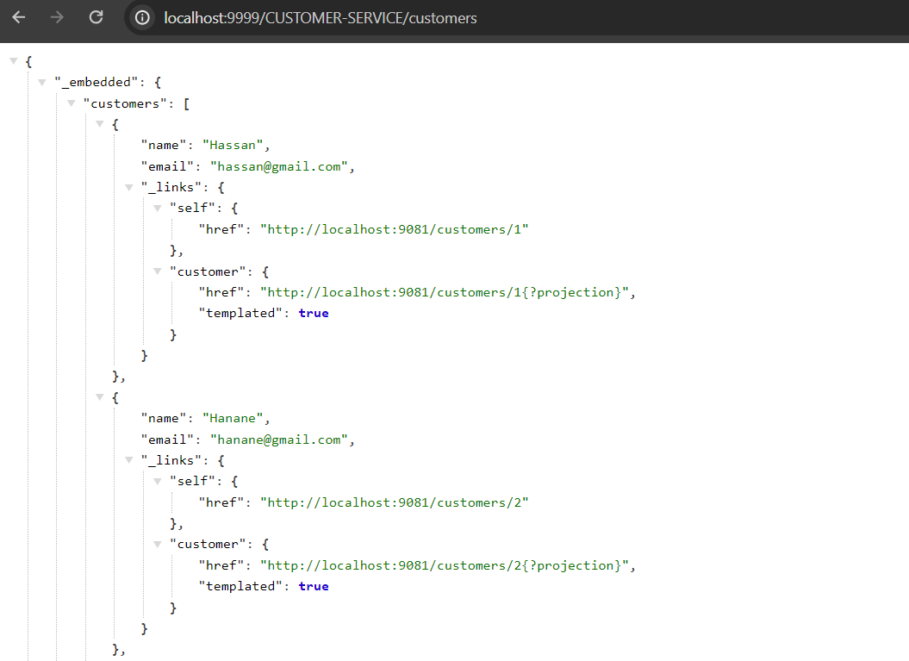
</li>
</ul>

3. **Create Inventory Service**
<ul>Steps to create this micros.
<li>1. create Product Entity.
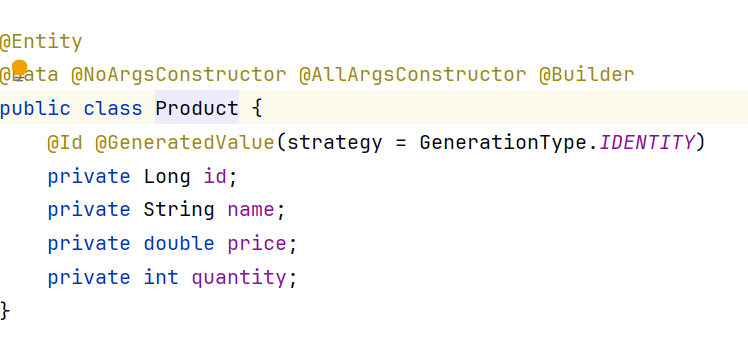
</li>
<li>2. create Product Repository.
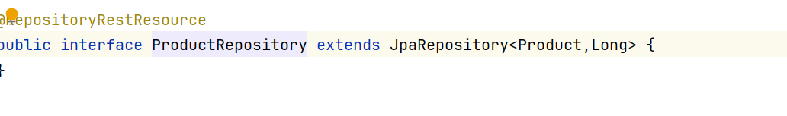</li>
<li>3. Added application.properties file to register this micros to eureka discovery and also the database infos.
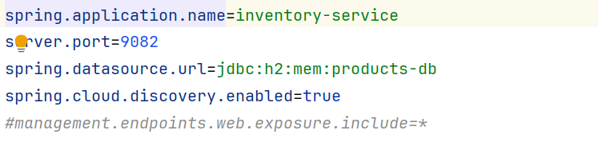</li>
<li>4. Display result which we contact the gateway and then the gateway dispatch this request to the correct micros.
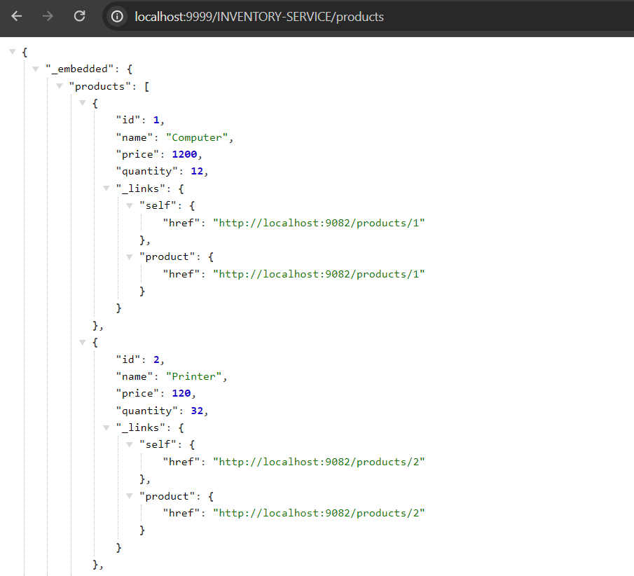
</li>
</ul>

3. **Create Billing Service**
<ul>Steps to create this micros.
<li>1. create Bill & ProductItem Entity.
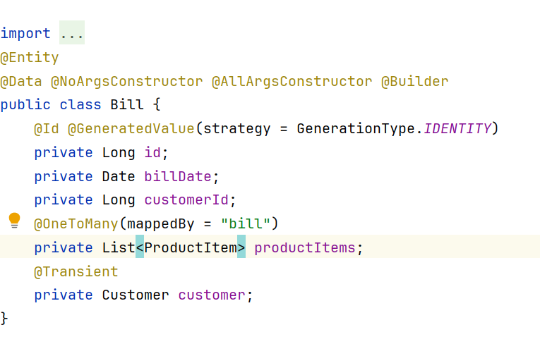
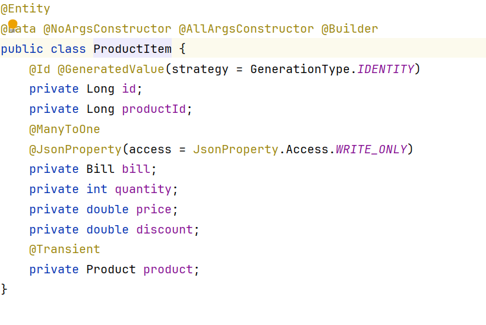
</li>
<li>2. create Customer & Product Model to dispaly details data which we retrieved from other micros.
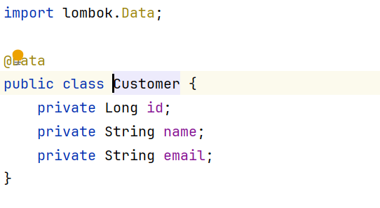
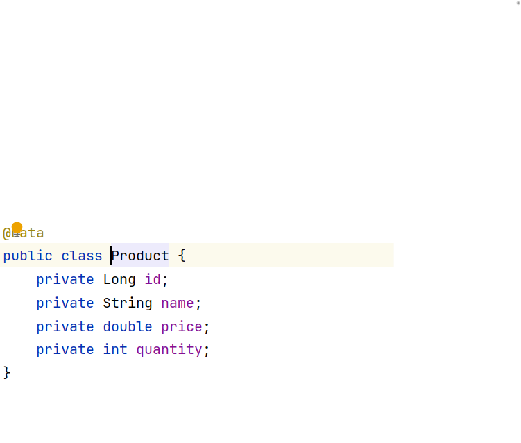
</li>
<li>3. create BillRepo & ProductItem Repo.
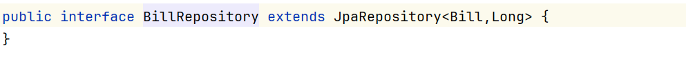
</li>
<li>4. Added application.properties file to register this micros to eureka discovery and also the database infos.
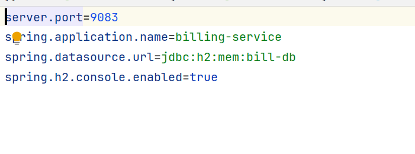
</li>
<li>5. added CustomerRestClient & ProductRestClient using openFeign framework for contacting other micros to retrieve the date reside in this micros .
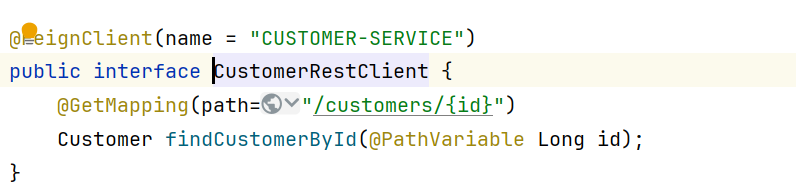
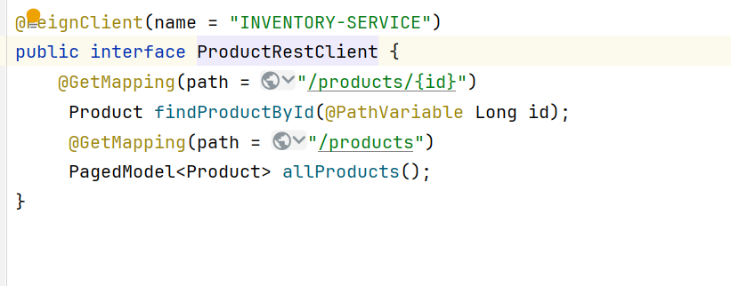
</li>
<li>6. Create Billing rest controller to fetch bill info.
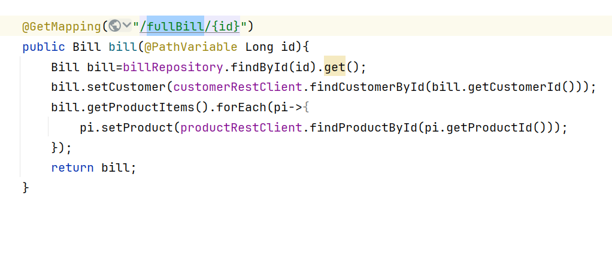
</li>
<li>7. Display result which we contact the gateway and then the gateway dispatch this request to the correct micros.
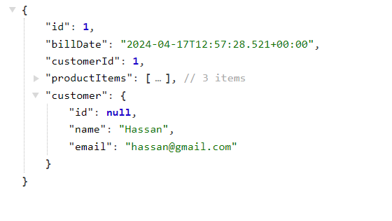
</li>
</ul>
